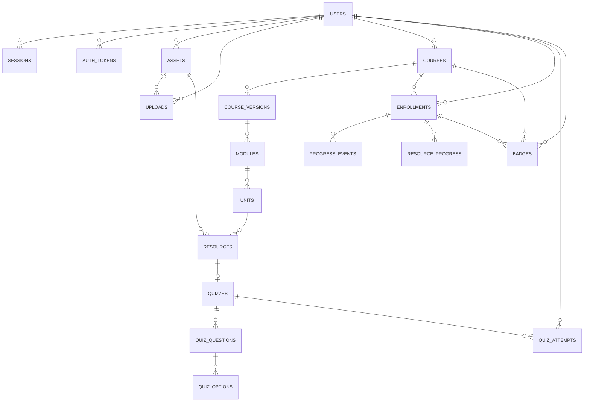

# Descripcion de la Arquitectura - Plataforma MOOC Cloud

Ivan Herrera
Elmar Santofimio
Kevin Leal
Santiago Moreno

Entrega 1 · ISIS4426 - Desarrollo de Soluciones Cloud · Universidad de los Andes

## 1. Introduccion y alcance

Este documento describe la arquitectura del backend de una plataforma de cursos masivos en linea (MOOC), desarrollado como Entrega 1 del curso ISIS4426 — Desarrollo de Soluciones Cloud, de la Universidad de los Andes. Esta entrega comprende unicamente el backend: no existe interfaz de usuario y no se incluye una en esta descripcion.

El sistema permite a un administrador crear profesores, a los profesores construir cursos versionados con modulos, unidades, recursos y cuestionarios, y a los estudiantes inscribirse, avanzar por el contenido y presentar cuestionarios para obtener una insignia de finalizacion.

## 2. Vision general

La arquitectura separa dos procesos de computo con responsabilidades distintas: una API HTTP sin estado que atiende peticiones sincronas, y un worker independiente que consume una cola de tareas para el trabajo pesado o de larga duracion. Ninguno de los dos procesos conserva informacion entre peticiones ni en el disco del contenedor; todo lo que debe persistir se escribe en PostgreSQL, en Redis o en el almacenamiento de objetos.

PostgreSQL es la unica fuente de verdad del sistema. Redis se usa exclusivamente como una capa de apoyo — cache de sesion, control de limite de tasa y cola de tareas — de modo que, si se pierde su contenido, el sistema sigue siendo consistente y solo se resienten trabajos en transito, nunca el estado academico de un curso. Los archivos binarios (videos, imagenes, PDFs, insignias) nunca atraviesan la API: el cliente los sube y los descarga directamente contra el almacenamiento de objetos mediante URLs prefirmadas de vida corta.

Tanto la API como el worker son horizontalmente escalables porque no dependen de estado en memoria ni de disco local; se pueden correr varias replicas de cualquiera de los dos sin coordinacion adicional.

## 3. Componentes del sistema

A continuacion se detallan los servicios que componen la infraestructura del sistema:

| Componente | Responsabilidad | Tecnologia |
|---|---|---|
| `cmd/api` | Expone la API REST: autenticacion, autoria de contenido, inscripciones, progreso y calificacion de cuestionarios. No ejecuta trabajo pesado. | Go, HTTP :8080 |
| `cmd/worker` | Consume la cola asincrona: transcodificacion de video a HLS, escaneo antimalware, envio de correo y emision de insignias. | Go, asynq, ffmpeg |
| PostgreSQL | Fuente de verdad transaccional: usuarios, cursos, versiones, progreso, intentos de quiz y bitacora de auditoria. | postgres:16-alpine |
| Redis | Cache de sesion, limites de tasa y cola de tareas (appendonly, sobrevive reinicios). | redis:7-alpine |
| MinIO | Almacenamiento de objetos compatible con S3: originales, derivados de video (HLS) e insignias. | quay.io/minio/minio |
| Mailpit | Servidor SMTP de pruebas; captura el correo transaccional sin enviarlo a destinatarios reales. | axllent/mailpit |
| Prometheus / Grafana | Recoleccion y visualizacion de metricas de la API y el worker. | prom/prometheus, grafana/grafana |
| Jaeger | Trazas distribuidas de la API y el worker via OpenTelemetry (OTLP). | jaegertracing/all-in-one |

## 4. Flujo de datos

### 4.1 Peticion sincrona

El cliente llama a la API por HTTPS/JSON. La API valida la sesion, resuelve autoria o pertenencia del recurso solicitado y lee o escribe contra PostgreSQL; adicionalmente usa Redis para limites de tasa y, cuando corresponde, para encolar una tarea. El aislamiento por propietario se resuelve en la condicion `WHERE` de cada consulta SQL, no con una verificacion posterior en el codigo de la aplicacion: si un recurso no pertenece al usuario autenticado, la fila simplemente no aparece en el resultado y la API responde 404, nunca 403, de modo que no se revela la existencia del recurso ajeno.

### 4.2 Subida y descarga de archivos

Un archivo nunca pasa por la API. El cliente solicita una intencion de subida; la API responde con una URL prefirmada contra MinIO y el cliente sube el archivo directamente a ese destino. Para esto, la API mantiene dos clientes de MinIO: uno interno, contra el nombre de host de Docker, con el que la propia API y el worker mueven bytes; y uno "firmante", contra el endpoint publico, porque el algoritmo de firma (SigV4) incluye el encabezado Host en la firma y esta debe corresponder con el host que el navegador del cliente va a resolver. La descarga sigue el mismo patron, con una URL prefirmada de solo lectura.

### 4.3 Procesamiento asincrono

El trabajo que no puede resolverse dentro del ciclo de una peticion HTTP se encola con asynq sobre Redis, en tres colas por prioridad (critical, default, low, con peso 6:3:1) para que una tarea corta como el envio de un correo o la emision de una insignia no espere detras de una transcodificacion de video larga. El worker desencola, procesa contra MinIO y PostgreSQL, y notifica por correo cuando aplica. La idempotencia se garantiza en tres capas: una llave de tarea (`asynq.TaskID`) evita encolar dos veces el mismo efecto; la tabla `processed_jobs` en PostgreSQL registra el trabajo ya terminado; y restricciones de integridad de base de datos —como un indice unico que impide dos insignias vigentes para la misma inscripcion— actuan como ultima defensa ante una carrera real entre dos instancias del worker.

## 5. Decisiones de arquitectura clave

- **Inmutabilidad de versiones publicadas:** editar un curso publicado crea una version nueva, clonada de la anterior, conservando los identificadores estables de cada nodo del arbol de contenido.
- **La clave de un cuestionario nunca sale al cliente:** vive en el snapshot publicado y solo la lee la rutina de calificacion en el servidor; lo que recibe el estudiante no incluye si una opcion es correcta.
- **El progreso lo calcula el servidor:** un porcentaje de avance enviado por el cliente se rechaza y se registra en la bitacora de auditoria; el avance real se deriva de eventos server-side.
- **Los cuestionarios son de seleccion multiple y solo de texto:** el esquema de preguntas y opciones no admite imagenes, video ni archivos adjuntos.
- **Control de roles:** el registro publico siempre crea un estudiante; solo un administrador puede crear una cuenta de profesor, y el sistema no permite quedarse sin al menos un administrador activo.

## 6. Modelo de datos

El esquema vive completo en PostgreSQL y se agrupa en cuatro dominios:

- **Identidad y acceso:** `users`, `sessions`, `auth_tokens`
- **Contenido:** `courses`, `course_versions`, `modules`, `units`, `resources`, `quizzes`, `quiz_questions`, `quiz_options`
- **Aprendizaje:** `enrollments`, `progress_events`, `resource_progress`, `quiz_attempts`, `badges`
- **Soporte operativo:** `assets`, `uploads`, `processed_jobs`, `audit_log`

Ninguna tabla almacena contenido binario: los recursos que viven en el almacenamiento de objetos se referencian por su llave.

### 6.1 Diagrama entidad-relacion

`audit_log` y `processed_jobs` quedan fuera del diagrama a proposito: la primera solo referencia a `users` de forma opcional (`actor_id`, se conserva aunque el usuario se borre) y la segunda no tiene ninguna llave foranea, es una tabla de control autonoma para la idempotencia de los workers (ver seccion 4.3).

## 7. Observabilidad y operacion

La API y el worker exportan trazas distribuidas a Jaeger via OTLP y metricas a Prometheus, visualizadas en Grafana. Cada peticion HTTP lleva un `X-Request-ID` para correlacion en logs. Queda como trabajo pendiente propagar el `traceparent` de la peticion HTTP hacia el trabajo que esa peticion encola, de modo que la traza de la API y la del worker se unan en una sola; hoy el span del worker es la raiz de su propia traza.

## 8. Cifrado y seguridad

Ninguna credencial se guarda ni viaja en claro. Las contrasenas se hashean con `bcrypt` y se validan contra una politica minima de longitud y complejidad. La API no usa JWT sino tokens opacos: el cliente recibe una cadena aleatoria y el servidor solo guarda su hash SHA-256, tanto para las sesiones de login como para los enlaces de verificacion de correo y de restablecimiento de contrasena. Asi, una fuga de la base de datos no permite reconstruir ningun token ni suplantar a un usuario, y revocar una sesion es inmediato porque borra a la vez la fila en Postgres y la cache en Redis. La clave de cada cuestionario recibe el mismo cuidado por otra via: vive en el snapshot del intento pero ninguna funcion de serializacion hacia el cliente la incluye, asi que nunca sale de la base de datos.

En cuanto al trafico, las URLs prefirmadas hacia el almacenamiento de objetos son de corta duracion (15 minutos) y firmadas con SigV4, de modo que un enlace filtrado deja de servir rapido. Tanto la conexion a MinIO/S3 como a PostgreSQL soportan TLS mediante variables de entorno (`S3_USE_SSL`, `sslmode`), desactivado en local porque ninguno de los servicios locales expone un certificado, y activable en la nube sin tocar el codigo. La API y el worker no terminan TLS ellos mismos; en la nube esa responsabilidad la asume el balanceador de entrada, que es el patron esperado para un backend sin estado con varias replicas.

Todos los secretos (contrasenas, llaves de acceso, cadenas de conexion) se leen unicamente por variables de entorno desde `internal/config`, nunca quedan escritos en el codigo, y el log de arranque esta escrito para no imprimirlos. A nivel HTTP, la API agrega cabeceras defensivas basicas (`nosniff`, `X-Frame-Options: DENY`, `Referrer-Policy`), usa la sesion en la cabecera `Authorization` en vez de una cookie (lo que elimina el riesgo de CSRF por construccion), aplica limite de tasa contra fuerza bruta en Redis y registra toda accion sensible en una bitacora de auditoria append-only.

Queda pendiente, de forma reconocida, el cifrado a nivel de disco de los volumenes de Postgres y MinIO, un gestor de secretos dedicado (Vault o similar) y un ClamAV real en lugar del stub que hoy solo detecta el archivo de prueba EICAR; ninguno de los tres requiere cambios de arquitectura, solo configuracion adicional en el entorno de nube.

## 9. Limitaciones conocidas

Nota de Deuda Tecnica: Algunas decisiones quedan deliberadamente simplificadas para esta entrega y estan documentadas como deuda tecnica reconocida: el escaneo antimalware es un stub que solo detecta el archivo de prueba EICAR, con una interfaz pensada para enchufar ClamAV mas adelante; no hay CDN en el entorno local (se activa cambiando una variable de entorno en la nube); y todavia no existen pruebas unitarias, solo la prueba de humo de extremo a extremo.

El despliegue en Google Cloud (Entrega 2) se documenta en [`docs/entrega2/`](docs/entrega2/README.md).
