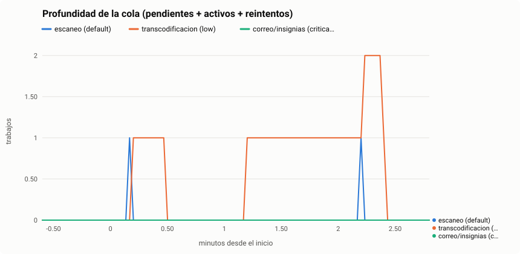
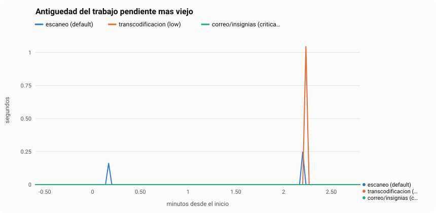
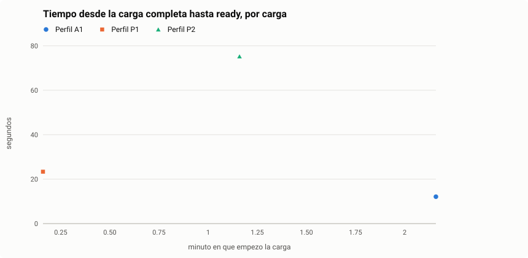
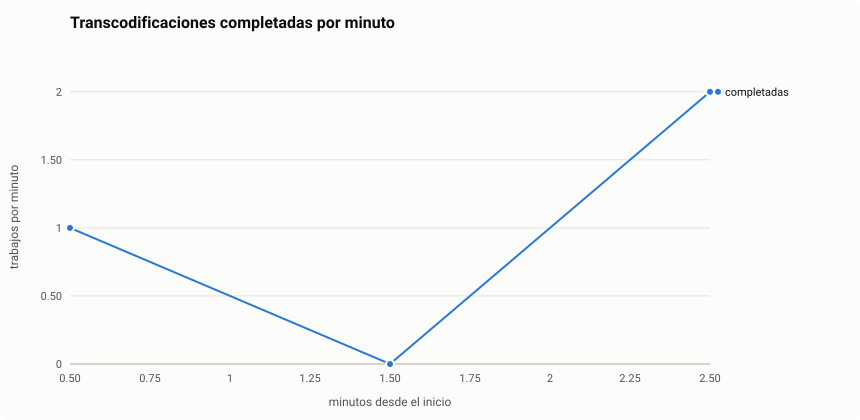
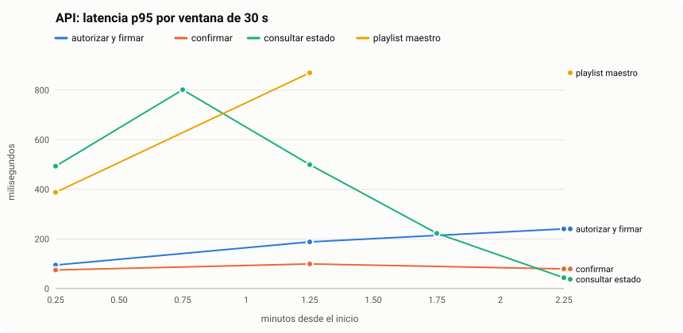
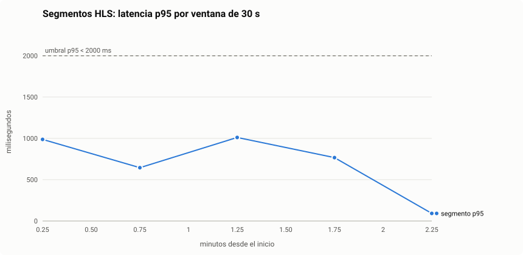

# Escenario 2 - Analisis de la corrida `20260927-1334_humo_local`

> Generado por `herramientas/analizador` el 2026-09-27 13:38 a partir de los archivos crudos de esta carpeta. No editar a mano: volver a generar.

## Condiciones

| Parametro | Valor |
|---|---|
| Nivel | humo |
| Modo (local/nube) | local |
| Inicio | 2026-09-27T13:34:59-05:00 |
| API | http://localhost:8080 |
| Version de k6 | k6 v1.3.0 (commit/5870e99ae8, go1.25.1, linux/amd64) |
| Commit evaluado | c710154 |
| Concurrencia de workers | 4 |
| Generador de carga | KEVINVICTUS, 12 vCPU, 3.6 GiB |
| Cargas por minuto | 1 |
| Espectadores concurrentes | 2 |
| Calentamiento / duracion | 20s / 2m |

## Resumen

| Indicador | Valor |
|---|---|
| Cargas iniciadas / llegaron a `ready` y validadas | 3 / 3 |
| API: autorizar y firmar p95 | 235 ms |
| API: confirmar carga p95 | 97 ms |
| Carga completa -> `ready` p50 / p95 / max | 23.4 s / 1.2 min / 1.3 min |
| Espera en cola de transcodificacion p95 / max | 3.41 s / 3.50 s |
| Trabajos HLS completados por minuto | 1.34 |
| Profundidad maxima de la cola `low` (HLS) / antiguedad maxima | 2 / 1.04 s |
| Drenaje de la cola tras la ultima carga | 16.5 s |
| Segmento HLS p50 / p95 / p99 | 77 ms / 874 ms / 1.76 s |
| Riesgo estimado de corte de reproduccion | 0.00 % |
| Errores: control / transferencia / segmentos / manifiestos | 0.00 % / 0.00 % / 0.00 % / 0.00 % |
| Rechazos por limite de tasa (429, esperados) | 0 |

### Criterios de exito (umbrales declarados en k6)

| Metrica | Umbral | Resultado |
|---|---|---|
| `e2_api_firma_ms` | `p(95)<1000` | cumple |
| `e2_carga_exitosa` | `rate>0.99` | cumple |
| `e2_manifiesto_ms{fase:medicion}` | `p(95)<1000` | **NO cumple** |
| `e2_riesgo_corte{fase:medicion}` | `rate<0.01` | cumple |
| `e2_segmento_ms{fase:medicion}` | `p(95)<2000` | cumple |
| `http_req_duration{name:GET /assets/:id (consultar estado)}` | `p(95)<500` | **NO cumple** |
| `http_req_duration{name:POST /units/:id/resources}` | `p(95)<1000` | cumple |
| `http_req_duration{name:POST /uploads (autorizar y firmar)}` | `p(95)<1000` | cumple |
| `http_req_duration{name:POST /uploads/:id/complete (confirmar)}` | `p(95)<1000` | cumple |
| `http_req_duration{name:PUT parte (almacenamiento)}` | `p(95)<30000` | cumple |
| `http_req_failed{tipo:consumo,fase:medicion}` | `rate<0.01` | cumple |
| `http_req_failed{tipo:consumo_api,fase:medicion}` | `rate<0.01` | cumple |
| `http_req_failed{tipo:control,fase:medicion}` | `rate<0.01` | cumple |
| `http_req_failed{tipo:transferencia,fase:medicion}` | `rate<0.01` | cumple |

## 1. Plano de control de la API (trafico que SI pasa por la API)

| Operacion | n | p50 | p95 | p99 | max |
|---|---:|---:|---:|---:|---:|
| POST /uploads (autorizar y firmar) | 3 | 188 ms | 235 ms | 239 ms | 240 ms |
| POST /uploads/:id/complete (confirmar) | 3 | 79 ms | 97 ms | 99 ms | 99 ms |
| POST /units/:id/resources | 3 | 33 ms | 49 ms | 50 ms | 50 ms |
| GET /assets/:id (consultar estado) | 35 | 26 ms | 587 ms | 742 ms | 801 ms |
| GET playlist maestro (estudiantes) | 3 | 176 ms | 833 ms | 892 ms | 906 ms |
| GET playlist variante (estudiantes) | 3 | 28 ms | 1.00 s | 1.09 s | 1.11 s |

Peticiones de control por segundo (medicion): 0.34. Tasa de error de control: 0.00 %.

## 2. Transferencia directa al almacenamiento de objetos (NO pasa por la API)

| Perfil | n | transferencia p50 | p95 | max | Mbps p50 | Mbps min |
|---|---:|---:|---:|---:|---:|---:|
| A1 | 1 | 1.93 s | 1.93 s | 1.93 s | 29.6 | 29.6 |
| P1 | 1 | 193 ms | 193 ms | 193 ms | 28.2 | 28.2 |
| P2 | 1 | 761 ms | 761 ms | 761 ms | 26.8 | 26.8 |

| Operacion | n | p50 | p95 | p99 | max |
|---|---:|---:|---:|---:|---:|
| PUT parte (almacenamiento) (cada parte de 8 MiB) | 3 | 444 ms | 677 ms | 698 ms | 703 ms |

Tasa de error de transferencia: 0.00 %.

## 3. Procesamiento asincrono (worker)

Tiempos por carga obtenidos uniendo el registro de k6 con los trabajos de asynq (`scan:<asset>`, `hls:<asset>`). Resolucion: ~2 s (muestreo) y 1 s (`CompletedAt`).

| Perfil | n ok | cola+escaneo p50 | espera cola HLS p50 | p95 | transcodificacion p50 | p95 | carga -> ready p50 | p95 | max |
|---|---:|---:|---:|---:|---:|---:|---:|---:|---:|
| A1 | 1 | 727 ms | 3.50 s | 3.50 s | 6.50 s | 6.50 s | 12.1 s | 12.1 s | 12.1 s |
| P1 | 1 | 0 ms | 2.55 s | 2.55 s | 17.4 s | 17.4 s | 23.4 s | 23.4 s | 23.4 s |
| P2 | 1 | 0 ms | 1.53 s | 1.53 s | 1.2 min | 1.2 min | 1.3 min | 1.3 min | 1.3 min |
| **Todas** | 3 | 0 ms | 2.55 s | 3.41 s | 17.4 s | 1.1 min | 23.4 s | 1.2 min | 1.3 min |

- Reintentos de trabajos de estas cargas: 0. Trabajos en DLQ (archivados) al final: 0.
- Extremo a extremo (inicio de la carga -> `ready`) p50 / p95: 23.7 s / 1.2 min.

## 4. Cola de mensajeria (Redis + asynq)

| Cola | Uso | profundidad max (pend+activos+reint) | antiguedad max del pendiente mas viejo |
|---|---|---:|---:|
| default | escaneo (media:scan) | 1 | 246 ms |
| low | transcodificacion HLS (media:transcode) | 2 | 1.04 s |

Trabajos HLS completados por minuto (desde la primera confirmacion hasta el ultimo `ready`): 1.34.

## 5. Consumo HLS (estudiantes)

| Operacion | n | p50 | p95 | p99 | max |
|---|---:|---:|---:|---:|---:|
| GET playlist maestro | 3 | 176 ms | 833 ms | 892 ms | 906 ms |
| GET playlist variante | 3 | 28 ms | 1.00 s | 1.09 s | 1.11 s |
| GET segmento (almacenamiento) (todas) | 43 | 77 ms | 874 ms | 1.76 s | 1.98 s |
|   segmento v360 | 6 | 213 ms | 668 ms | 713 ms | 725 ms |
|   segmento v480 | 11 | 34 ms | 1.03 s | 1.79 s | 1.98 s |
|   segmento v720 | 26 | 80 ms | 848 ms | 1.31 s | 1.45 s |

- Tasa de transferencia por segmento p50: 186.2 Mbps. Errores en segmentos: 0.00 %; en manifiestos: 0.00 %.
- Riesgo estimado de corte: 0.00 % de los segmentos llegaron despues del momento en que la reproduccion simulada los necesitaba. Es una estimacion a partir de peticiones HTTP; NO es tiempo hasta el primer cuadro ni interrupciones medidas con un reproductor.
- Segmentos por segundo (medicion): 0.31.

## 6. Recursos de las maquinas y contenedores

Sin datos de recursos (faltan `recursos_*.csv`).

## 7. Graficas

## Archivos de esta corrida

`metadata.json` (condiciones), `salida_k6.txt` y `resumen_k6.json` (resumen de k6), `reporte_k6.html` (panel de k6), `crudo_k6.json.gz` (todas las muestras), `consola_k6.log` (una linea por carga), `cola.csv`, `tareas_eventos.csv`, `tareas_final.csv` (cola), `recursos_*.csv` (maquinas) y `cargas.csv` (una fila por carga con todos sus tiempos).
