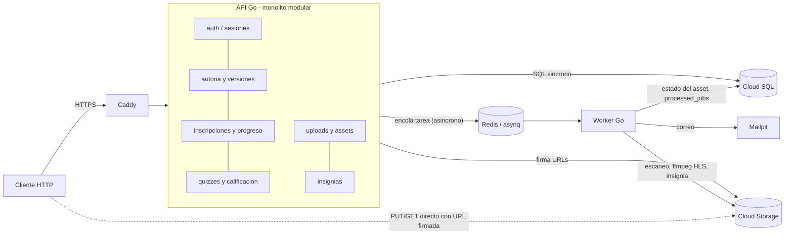

# Entrega 2 - Despliegue basico en Google Cloud

ISIS4426 - Desarrollo de Soluciones Cloud · Universidad de los Andes · 2026-20

Este documento describe la solucion **efectivamente desplegada** en Google Cloud y los cambios frente a la Entrega 1. La arquitectura logica de la aplicacion (modulos, reglas de negocio, modelo de datos) no cambia y sigue documentada en [`ARQUITECTURA.md`](../../ARQUITECTURA.md); aqui se documenta como se distribuye en la nube.

> Los valores marcados como **PENDIENTE** se completan con datos del entorno desplegado (IPs, costos observados, fechas) y no deben inventarse.

## 1. Resumen de cambios frente a la Entrega 1

| Aspecto | Entrega 1 (local) | Entrega 2 (GCP) |
|---|---|---|
| Computo | Un `docker-compose.yml` con todo | Dos VMs: **Web Server** (API + Caddy) y **Worker Server** (worker + Redis + Mailpit) |
| PostgreSQL | Contenedor `postgres:16-alpine` | **Cloud SQL** PostgreSQL 16, IP privada, TLS obligatorio, una zona |
| Objetos | MinIO en contenedor | **Cloud Storage**, bucket privado, acceso por API XML compatible con S3 |
| Cola | Redis en contenedor | Igual (Redis + asynq), ahora en el Worker Server y alcanzable solo desde el Web Server |
| Interfaz | Solo backend (sin frontend) | **Frontend Next.js (BFF)** servido en el mismo dominio; Caddy enruta `/api/v1/*` a la API y el resto al frontend |
| Acceso publico | `http://localhost:8080` | `https://<IP>.sslip.io` con certificado Let's Encrypt (Caddy) |
| Secretos | `.env` versionado | `/etc/mooc/*.env` fuera del repo (permisos 600); en git solo plantillas `*.env.example` |
| Credenciales de objetos | Una sola (`minioadmin`) | Una cuenta de servicio y una llave HMAC **por componente** |
| Observabilidad | Prometheus, Grafana, Jaeger en el mismo host | Cloud Monitoring con Ops Agent en las VMs + metricas de Cloud SQL; Prometheus y exportadores en el Web Server (solo localhost); Grafana en el PC del analista por tunel IAP |

**Cambios en el backend: ninguno.** La API y el worker ya leian toda su configuracion de variables de entorno (`internal/config`) y hablaban S3 con `minio-go`. Pasar de MinIO a Cloud Storage y de un Postgres local a Cloud SQL es solo configuracion. El unico codigo nuevo es el **frontend** (`frontend/`), que se despliega como un contenedor mas en el Web Server y no modifica el backend.

## 2. Correspondencia entre el enunciado y los servicios de GCP

| Capacidad pedida | Servicio de GCP | Recurso |
|---|---|---|
| Maquinas virtuales (Web Server, Worker Server) | Compute Engine | `web-server`, `worker-server` |
| Red virtual privada y subredes | VPC (modo custom) | `mooc-vpc`, `mooc-web`, `mooc-worker` |
| Reglas de firewall | VPC firewall rules | `mooc-allow-*` |
| Conectividad saliente del worker | Cloud Router + Cloud NAT | `mooc-router`, `mooc-nat` |
| Base de datos relacional administrada | Cloud SQL for PostgreSQL | `mooc-pg` |
| Conexion privada a la BD | Private Service Access (VPC peering) | rango `mooc-psa` |
| Almacenamiento de objetos | Cloud Storage | `gs://mooc-<proyecto>` |
| Permisos diferenciados | IAM + llaves HMAC | `mooc-api`, `mooc-worker`, `mooc-vm` |
| Administracion sin exponer SSH | Identity-Aware Proxy (TCP forwarding) | regla `mooc-allow-iap-ssh` |
| Metricas de CPU, memoria, disco | Cloud Monitoring + Ops Agent | instalado por `startup.sh` |
| Presupuesto y alertas | Cloud Billing Budgets | `mooc-entrega2` |

## 3. Modelo de componentes



| Componente | Responsabilidad | Comunicacion |
|---|---|---|
| API (`cmd/api`) | Autenticacion con tokens opacos, autoria versionada, inscripciones, progreso calculado en servidor, calificacion de quizzes, emision de URLs firmadas | Sincrona con Cloud SQL; asincrona hacia Redis (encola); firma URLs sin transferir bytes |
| Worker (`cmd/worker`) | Escaneo antimalware (stub EICAR), transcodificacion a HLS con ffmpeg, emision de insignias, correo, limpieza de cargas vencidas | Consume la cola en Redis; lee y escribe Cloud Storage y Cloud SQL |
| Redis + asynq | Cola con tres prioridades (critical 6, default 3, low 1), cache de sesion y limite de tasa | Solo red privada, con contrasena |
| Cloud SQL | Fuente de verdad transaccional | TLS sobre IP privada |
| Cloud Storage | Originales, derivados HLS, insignias | HTTPS; el cliente sube y descarga directamente |
| Frontend (`frontend/`, BFF Next.js) | Sirve la interfaz y actua como Backend For Frontend: guarda el token de sesion en una cookie HttpOnly y reenvia a la API por la red interna (`api:8080`) | El navegador solo habla con el; el BFF llama a la API sin salir a Internet |
| Caddy | Proxy inverso y terminacion TLS; enruta `/api/v1/*` a la API y el resto al frontend; oculta `/metrics` | Unico servicio expuesto a Internet |

La idempotencia se conserva en sus tres capas (`asynq.TaskID`, tabla `processed_jobs`, restricciones de integridad como `uniq_badge_alive`), ahora con la cola y la base en maquinas distintas.

## 4. Modelo de despliegue



Fuente del diagrama: [`diagramas/despliegue.mmd`](diagramas/despliegue.mmd). El comando para regenerarlo esta en la cabecera del archivo.

### 4.1 Red

| Recurso | Valor | Proposito |
|---|---|---|
| Region / zona | `us-central1` / `us-central1-a` | Todo en una zona, como pide el enunciado |
| VPC | `mooc-vpc`, modo custom | Sin las reglas permisivas de la red `default` |
| Subred publica | `mooc-web` `10.20.1.0/24` | Web Server, con IP publica estatica |
| Subred privada | `mooc-worker` `10.20.2.0/24` | Worker Server, **sin IP publica** |
| Private Google Access | habilitado en ambas subredes | El worker llega a `storage.googleapis.com` sin salir a Internet |
| Cloud NAT | solo para `mooc-worker` | Salida del worker para `apt` y `docker pull` |
| Private Service Access | rango `mooc-psa` /20 | IP privada de Cloud SQL dentro de la VPC |

### 4.2 Reglas de firewall

Todo el trafico entrante que no aparece aqui queda bloqueado por la regla implicita de la VPC.

| Regla | Origen | Destino | Puertos | Motivo |
|---|---|---|---|---|
| `mooc-allow-web-https` | `0.0.0.0/0` | tag `web-server` | tcp 80, 443 | Unico punto publico (80 solo redirige a 443) |
| `mooc-allow-iap-ssh` | `35.235.240.0/20` (IAP) | `web-server`, `worker-server` | tcp 22 | Administracion sin exponer SSH |
| `mooc-allow-web-to-redis` | tag `web-server` | tag `worker-server` | tcp 6379 | La API encola; nadie mas llega a Redis |
| `mooc-allow-monitor` | tag `monitor` (el Web Server) | `web-server`, `worker-server` | tcp 8080, 9100 | Prometheus raspa las metricas de la API y del worker |

Cloud SQL no admite conexiones fuera de la VPC (`--no-assign-ip`) y exige TLS (`--ssl-mode=ENCRYPTED_ONLY`).

### 4.3 Maquinas virtuales

| VM | Tipo | Disco | IP privada | IP publica | Contenedores |
|---|---|---|---|---|---|
| `web-server` | `e2-highcpu-2` (2 vCPU, 2 GiB) | 30 GB pd-balanced | `10.20.1.10` | estatica `mooc-web-ip` | `api`, `web` (frontend), `caddy` |
| `worker-server` | `e2-highcpu-2` (2 vCPU, 2 GiB) | 30 GB pd-balanced | `10.20.2.10` | ninguna | `worker`, `redis`, `mailpit` |

**Justificacion del tipo:** el enunciado fija 2 vCPU, 2 GiB y 30 GiB por VM. `e2-highcpu-2` es exactamente esa combinacion (2 vCPU, 2048 MB). Se descarto `e2-small`, que tambien anuncia 2 vCPU pero de nucleo compartido (0.5 vCPU sostenida con rafagas), porque haria que los resultados de carga dependieran de los creditos de rafaga; y `e2-medium`, que duplica la memoria. La configuracion efectiva coincide con la pedida, sin ajuste.

**Ajuste aplicado:** compilar la imagen de Go dentro de una VM de 2 GiB puede quedarse sin memoria, asi que `startup.sh` crea 2 GiB de swap. El swap solo cubre el pico del build; en operacion se vigila que no se use. Si durante las pruebas se observa uso sostenido de swap, se documenta como hallazgo de capacidad. PENDIENTE: registrar si el build falla sin swap.

Volumenes persistentes: `redisdata` (AOF de Redis) en el Worker Server y `caddydata` (certificados) en el Web Server, ambos en el disco de arranque.

### 4.4 Servicios administrados

| Servicio | Configuracion |
|---|---|
| Cloud SQL `mooc-pg` | PostgreSQL 16, edicion Enterprise, `db-custom-1-3840` (1 vCPU, 3.75 GB), 10 GB SSD, zonal, sin replicas, respaldo diario 07:00 UTC |
| Cloud Storage | Clase Standard, `us-central1`, acceso uniforme, prevencion de acceso publico, CORS para GET/HEAD/PUT |

El tamano de Cloud SQL se eligio para que la BD no sea el cuello de botella artificial por tener nucleo compartido: `db-f1-micro` y `db-g1-small` no tienen vCPU dedicada y limitan `max_connections` a 25 y 50. La API abre como maximo 25 conexiones (`internal/database/postgres.go`) y el worker otras 25.

## 5. Decisiones y adaptaciones

**Redis en el Worker Server.** El enunciado lo pide asi y tiene sentido: el worker es el consumidor mas intenso de la cola. La API lo alcanza por la IP privada `10.20.2.10:6379`, con contrasena, y la regla de firewall solo admite trafico desde el Web Server. El puerto no se expone a Internet porque la VM no tiene IP publica.

**Migracion de MinIO a Cloud Storage.** Cloud Storage expone una API XML compatible con S3 que acepta llaves HMAC. Como la aplicacion ya usaba `minio-go`, basto con cambiar `S3_ENDPOINT` y `S3_PUBLIC_ENDPOINT` a `storage.googleapis.com` y activar TLS. La organizacion logica se conserva (`originals/`, `hls/`, `badges/`) y la base guarda llaves relativas al bucket, asi que no hubo que reescribir referencias. La copia y la verificacion byte a byte se hacen con `deploy/gcp/migrate.sh objects` (rclone), y la correspondencia BD-bucket con `deploy/gcp/migrate.sh verify`.

**Carga directa y URLs firmadas.** Sin cambios en el flujo: la API inicia la carga multipart y firma una URL por parte; el cliente sube cada parte directamente a Cloud Storage por HTTPS; la API cierra la carga y encola el escaneo. Las descargas usan URLs firmadas de 15 minutos. Como el bucket no es publico, un objeto solo se puede leer con una URL que la API haya emitido tras verificar la autorizacion.

**Permisos diferenciados por componente.**

| Identidad | Permisos sobre el bucket | Por que |
|---|---|---|
| `mooc-api` (HMAC en el Web Server) | `objectCreator`, `objectViewer`, `legacyBucketReader` | Inicia cargas, lee metadatos, firma URLs. No puede borrar |
| `mooc-worker` (HMAC en el Worker Server) | `objectUser` | Lee originales, escribe derivados e insignias y borra archivos infectados |
| `mooc-vm` (identidad de las VMs) | ninguno | Solo escribe logs y metricas |

Una URL firmada actua con los permisos de quien la firma, asi que el cliente nunca puede hacer mas de lo que la cuenta `mooc-api` permite.

**HTTPS, cookies y CSRF.** Caddy termina TLS con un certificado de Let's Encrypt para `<IP-con-guiones>.sslip.io`, un dominio publico que resuelve a la IP embebida y evita comprar un dominio. La **API Go** sigue sin usar cookies: la sesion viaja en la cabecera `Authorization: Bearer`, por lo que la API no es vulnerable a CSRF por construccion (ver `internal/api/middleware.go`). El **frontend (BFF)** si usa una cookie, pero por un motivo de seguridad distinto: el token opaco se guarda en una cookie **HttpOnly** (ademas `Secure`, al servirse por HTTPS, y `SameSite=Lax`), de modo que el JavaScript del navegador no puede leerlo y un XSS no puede robar la sesion. El token nunca llega al almacenamiento del navegador. El BFF lee esa cookie en el servidor y la traduce a la cabecera `Authorization: Bearer` al llamar a la API. `SameSite=Lax` y el hecho de que las mutaciones vayan por Server Actions (POST) mitigan el CSRF a nivel del frontend. Las comprobaciones de autorizacion por rol se hacen en el servidor del frontend (ademas de en la API Go): defensa en profundidad.

**Workers.** Concurrencia fija en 2 (`WORKER_CONCURRENCY`) durante todas las corridas, para no saturar 2 vCPU con dos ffmpeg simultaneos. Reintentos: 3 (`MAX_RETRIES`).

**Observabilidad.** Jaeger no cabe en 2 GiB junto a la aplicacion, asi que las trazas se apagan en la nube (`OTEL_EXPORTER_OTLP_ENDPOINT` vacio). CPU, memoria, disco y red de las VMs vienen del Ops Agent (Cloud Monitoring), y CPU y memoria de Cloud SQL de sus metricas nativas. Para las metricas de aplicacion y de la cola, Prometheus, `redis-exporter` y `postgres-exporter` corren en el Web Server ([`deploy/gcp/monitor/`](../../deploy/gcp/monitor/)), escuchando solo en localhost; el tag `monitor` le permite raspar `worker:9100`. Grafana no corre en la nube: corre en el PC de quien analiza y lee Prometheus por un tunel IAP.

*Ajuste frente a una maquina de monitoreo dedicada.* La cuota del proyecto es de 12 vCPU (`CPUS_ALL_REGIONS`) y estaba llena, asi que no se pudo crear una tercera VM. Se eligio el Web Server y no el Worker Server porque en el escenario 2 ffmpeg satura el worker. Costo medido en reposo: 76 MB de RAM y menos del 1% de CPU entre los tres contenedores, con topes de memoria de 400 MB (Prometheus) y 64 MB (cada exportador). En el informe de capacidad se reporta su consumo durante cada corrida para acotar su efecto sobre la API.

**Diferencias frente a la arquitectura objetivo del proyecto.**

| Arquitectura objetivo | Esta entrega | Motivo |
|---|---|---|
| Balanceador y varias replicas de la API | Una sola VM web | Excluido por el enunciado |
| Autoescalado de workers | Concurrencia y numero de VMs fijos | Excluido por el enunciado |
| CDN para HLS | Contenido servido desde el bucket | Etapa posterior (`CDN_BASE_URL` ya existe) |
| Alta disponibilidad de la BD | Cloud SQL zonal, sin replicas | Excluido por el enunciado |
| Redis/cola administrados | Redis en contenedor | Excluido por el enunciado |
| Antimalware real | Stub EICAR | Deuda tecnica conocida; interfaz lista para ClamAV |

## 6. Operacion y recuperacion

Todos los scripts estan en [`deploy/gcp/`](../../deploy/gcp/).

### 6.1 Despliegue desde cero

```bash
# En Cloud Shell, con el repositorio clonado
export PROJECT=dsc-uniandes-20262
./deploy/gcp/provision.sh todo          # red, firewall, Cloud SQL, bucket, cuentas, VMs (~15 min)
./deploy/gcp/provision.sh config        # genera y copia /etc/mooc/*.env a cada VM

# En cada VM (gcloud compute ssh <vm> --zone=us-central1-a --tunnel-through-iap)
git clone https://github.com/Klealp/Platform-MOOC-Cloud.git && cd Platform-MOOC-Cloud
sudo docker compose -f deploy/gcp/worker/docker-compose.yml up -d --build   # worker-server, primero
sudo docker compose -f deploy/gcp/web/docker-compose.yml up -d --build      # web-server (api + frontend + caddy)

# Solo en web-server, una vez
./deploy/gcp/migrate.sh init-db
```

El orden importa: la API necesita Redis al arrancar, y Redis vive en el Worker Server.

### 6.2 Migracion desde la Entrega 1

1. En la maquina origen: `./deploy/gcp/migrate.sh dump-db` y copiar `mooc.dump` al Web Server.
2. En el Web Server: `./deploy/gcp/migrate.sh restore-db mooc.dump` (en lugar de `init-db`).
3. En la maquina origen: `BUCKET=... HMAC_ID=... HMAC_SECRET=... ./deploy/gcp/migrate.sh objects`. Usa la llave del worker, que tiene escritura. Copia y luego compara el contenido byte a byte.
4. En el Web Server: `./deploy/gcp/migrate.sh verify` comprueba que cada llave referenciada por la BD exista en el bucket.

### 6.3 Verificacion

- `curl https://<dominio>/readyz` debe responder `{"checks":{"postgres":"ok","redis":"ok","storage":"ok"},"ready":true}`.
- Pruebas de humo: `API=https://<dominio>/api/v1 ADMIN_PASSWORD=... ./testdata/smoke.sh`. En produccion la API no devuelve el token de verificacion de correo (solo en `APP_ENV=dev`), asi que el token se lee de Mailpit: `gcloud compute ssh worker-server --tunnel-through-iap -- -L 8025:localhost:8025` y abrir `http://localhost:8025`. PENDIENTE: adaptar los smoke tests para leerlo de la API de Mailpit.

### 6.4 Reinicio, respaldo y reconstruccion

| Operacion | Como |
|---|---|
| Reiniciar la app | `sudo docker compose -f deploy/gcp/<web\|worker>/docker-compose.yml restart` |
| Actualizar codigo | `git pull && sudo docker compose -f ... up -d --build` |
| Respaldo de la BD | Automatico diario (7 dias). Manual: `gcloud sql backups create --instance=mooc-pg` |
| Respaldo exportable | `gcloud sql export sql mooc-pg gs://<bucket-respaldos>/mooc-$(date +%F).sql --database=mooc` |
| Cola | Redis con AOF en el volumen `redisdata`; si se pierde, Postgres sigue siendo correcto (solo se pierden trabajos en transito) |
| Reconstruir todo | `provision.sh todo` + `config` + seccion 6.1 + restaurar el respaldo |

### 6.5 Configuracion y secretos

| Que | Donde |
|---|---|
| Plantillas sin secretos (en git) | `deploy/gcp/web/web.env.example`, `deploy/gcp/worker/worker.env.example` |
| Configuracion efectiva | `/etc/mooc/web.env` y `/etc/mooc/worker.env` en cada VM (root, 600) |
| Secretos generados | `$HOME/.mooc-secrets/<proyecto>/` en la maquina de quien aprovisiona (600) |
| Contrasena de admin, BD, Redis, llaves HMAC | Generadas por `provision.sh`; nunca en el repo ni en las imagenes |

Los valores por defecto de desarrollo (`minioadmin`, `Admin123!`) solo existen en el entorno local y no se usan en la nube.

## 7. Capacidad, costo y limitaciones

### 7.1 Configuracion exacta

PENDIENTE: completar con la salida de `./deploy/gcp/provision.sh resumen` y la fecha.

### 7.2 Estimacion de costo

Precios de lista de referencia para `us-central1`, sin descuentos por uso sostenido. **Deben confirmarse en la [Calculadora de precios de Google Cloud](https://cloud.google.com/products/calculator) con la fecha de consulta antes de entregar.** PENDIENTE: fecha de consulta.

| Recurso | Unidad | Precio aprox. | Mes completo (730 h) |
|---|---|---|---|
| 2 x VM `e2-highcpu-2` (2 vCPU / 2 GiB) | por VM-hora | ~0.049 USD | ~72 USD |
| 2 x disco pd-balanced 30 GB | GB-mes | ~0.10 USD | ~6 USD |
| IP publica del Web Server | hora | ~0.005 USD | ~3.7 USD |
| Cloud NAT (1 VM) | hora + GB procesado | ~0.0014 USD + 0.045/GB | ~1 USD + trafico |
| Cloud SQL db-custom-1-3840 | hora | ~0.068 USD | ~49 USD |
| Cloud SQL SSD 10 GB + respaldos | GB-mes | ~0.17 + 0.08 USD | ~2 USD |
| Cloud Storage Standard | GB-mes | ~0.020 USD | depende del volumen |
| Operaciones de Cloud Storage | 1000 ops clase A / B | ~0.005 / 0.0004 USD | depende de las pruebas |
| Salida a Internet | GB | ~0.12 USD | depende del consumo HLS |

**Supuestos del plan de uso (PENDIENTE confirmar):** los recursos se encienden solo para implementar, probar y sustentar. Detener una VM elimina el costo de computo, pero no el del disco ni el de la IP estatica; Cloud SQL detenida sigue cobrando el almacenamiento. Tras entregar se exporta la BD y se elimina la instancia de Cloud SQL.

PENDIENTE: consumo observado (Billing > Reports, filtrado por proyecto) contrastado con la estimacion.

### 7.3 Puntos unicos de falla

| Componente | Efecto si falla |
|---|---|
| Web Server | La plataforma no responde (no hay replica ni balanceador) |
| Worker Server | Se pierden el worker y Redis. La API sigue atendiendo: las sesiones se validan contra Postgres (`internal/auth`) y el limite de tasa se desactiva en vez de bloquear (`internal/api/ratelimit.go`). Pero nada que dependa de la cola avanza: escaneo, transcodificacion, insignias y correo |
| Cloud SQL zonal | Sin BD no hay servicio; se recupera desde respaldo |
| Zona `us-central1-a` | Todo cae |

### 7.4 Evolucion hacia una aplicacion elastica

La API y el worker ya no guardan estado, asi que la evolucion es de infraestructura:
1. Grupo de instancias administrado para la API detras de un balanceador HTTPS, con autoescalado por CPU o por latencia.
2. Redis en Memorystore, para que el Worker Server deje de ser un punto de falla de la API.
3. Workers en un grupo autoescalado por profundidad de cola.
4. Cloud SQL regional (alta disponibilidad) y replicas de lectura para el catalogo.
5. Cloud CDN delante del bucket para HLS, activando `CDN_BASE_URL`.

Cual de estos cambios aporta mas capacidad lo decide el analisis en [`capacity-planning/pruebas_de_carga_entrega2.md`](../../capacity-planning/pruebas_de_carga_entrega2.md).
